The environment uses a segmented `10.10.0.0/16` VNet with dedicated web, application, and management subnets.

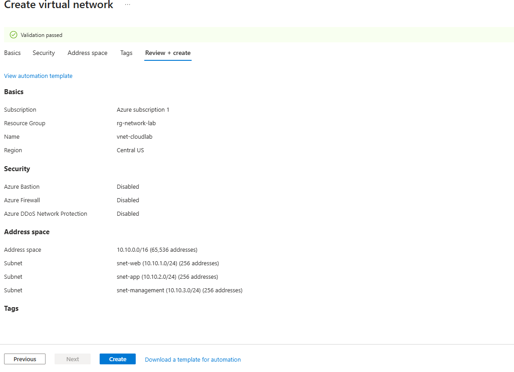

# Azure Mini Landing Zone Lab

# Project Overview

Built a small Azure landing-zone-style environment to practice core Azure administration, networking, security, RBAC, monitoring, workload deployment, troubleshooting, and cost management.

# Architecture
```text
Azure Subscription
├── rg-network-lab
│   ├── vnet-cloudlab - 10.10.0.0/16
│   │   ├── snet-web - 10.10.1.0/24
│   │   ├── snet-app - 10.10.2.0/24
│   │   └── snet-management - 10.10.3.0/24
│   ├── nsg-web-lab
│   ├── nsg-app-lab
│   └── nsg-management-lab
│
├── rg-workload-lab
│   └── vm-web-01
│
└── rg-monitoring-lab
```

Network Security
The web subnet was protected with a Network Security Group allowing HTTPS traffic on TCP 443.
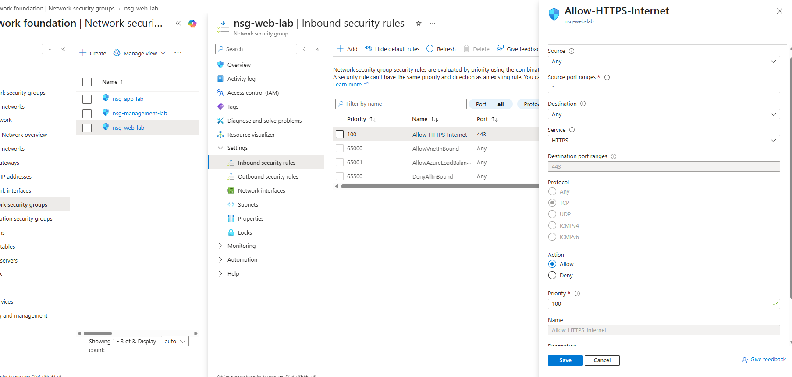

The application subnet was configured to allow web-tier traffic on TCP 8080 while denying other unnecessary VNet traffic.
Public SSH access was intentionally not enabled.
VM Configuration
An Ubuntu Server VM named `vm-web-01` was deployed into `snet-web`.
Cost-control and diagnostic settings were configured, including automatic shutdown and boot diagnostics.

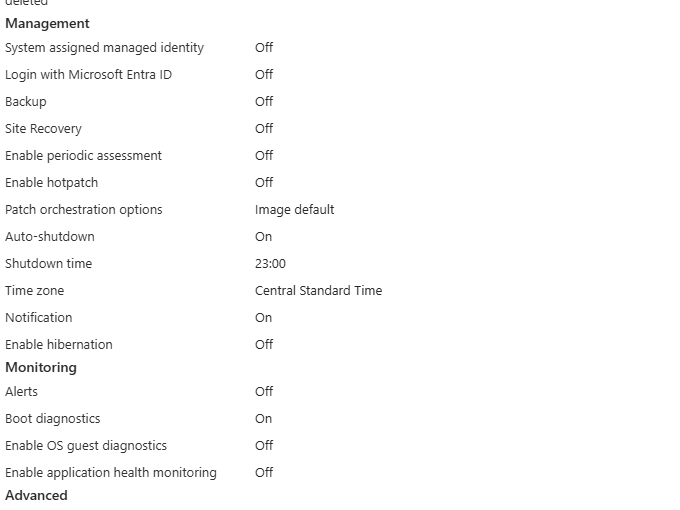
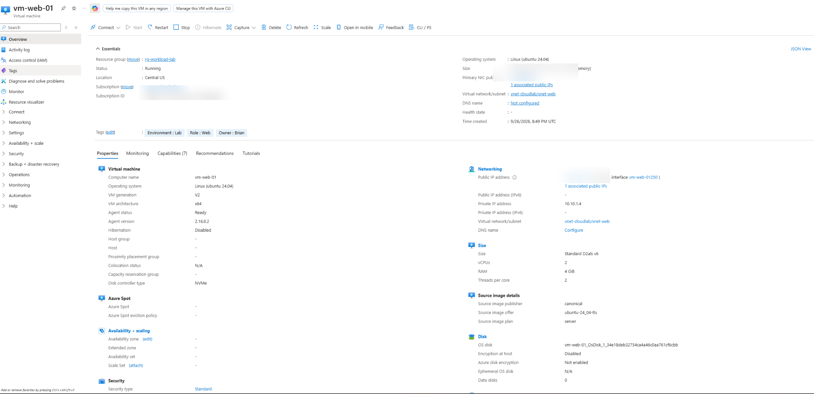
Nginx Web Server
Nginx was installed and validated as an active service.
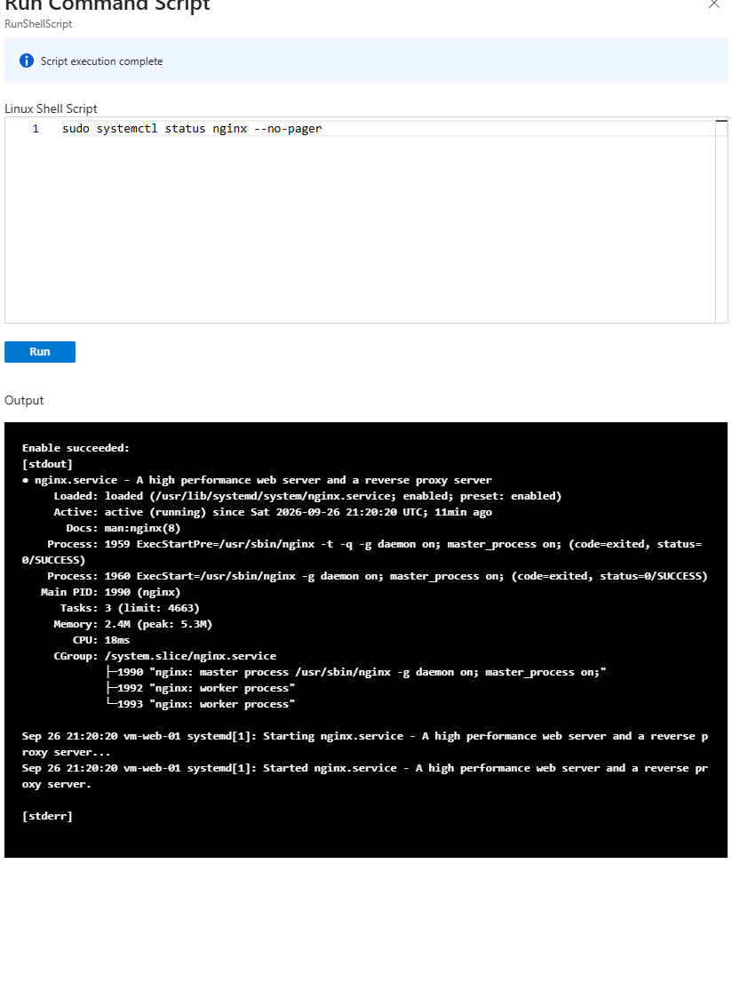

Nginx was then configured to listen on HTTPS TCP 443 using a temporary self-signed TLS certificate for lab testing.

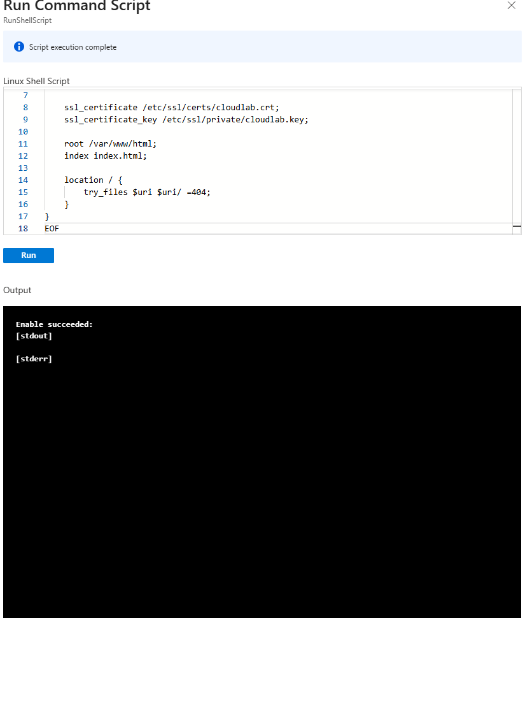
# Troubleshooting: 
During testing, the site initially returned a `403 Forbidden` response.
This helped isolate the problem: the request successfully reached Nginx, so the Azure network path was functioning. The issue was with the web content configuration rather than the NSG or public network path.

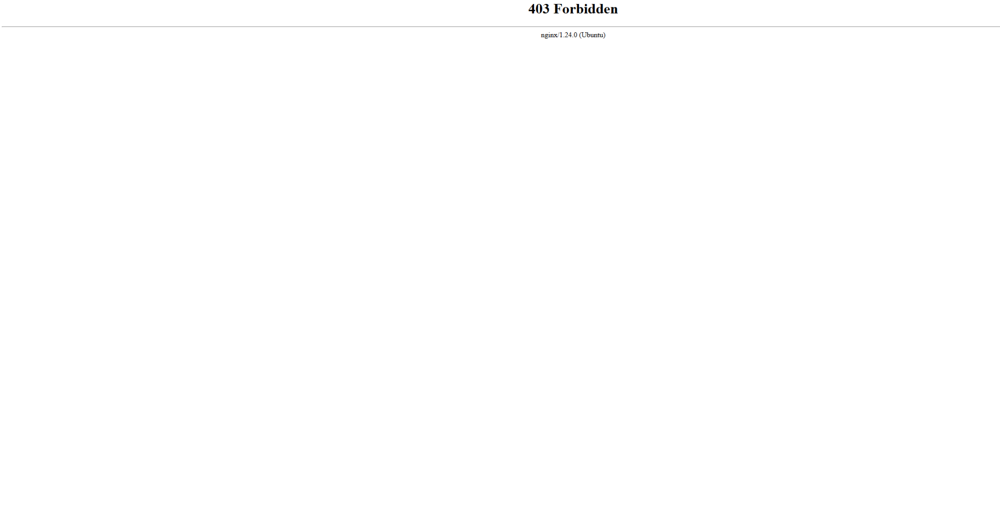
After creating the expected `index.html` file, HTTPS was validated locally from inside the VM.

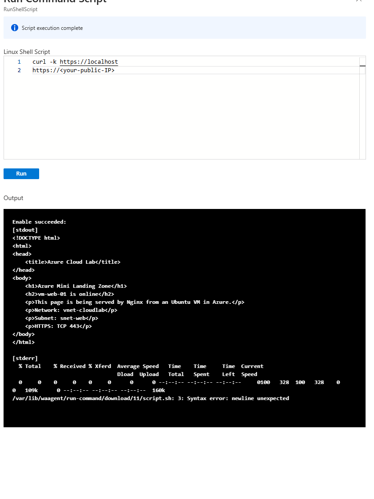
# Successful External Validation

The custom landing-zone webpage was successfully accessed externally over HTTPS.
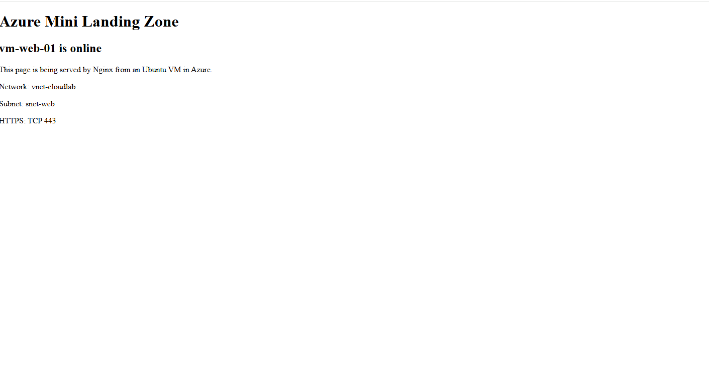
Validated traffic path:
```text
Internet
   ↓
Azure Public IP
   ↓
nsg-web-lab
   ↓ TCP 443
snet-web
   ↓
vm-web-01
   ↓
Nginx
   ↓
HTTPS webpage
```
# RBAC
Created the Microsoft Entra security group:
`Cloud-Lab-Readers`
Assigned the Azure `Reader` role at the `rg-workload-lab` resource-group scope.
This demonstrates least-privilege access by allowing members to view workload resources without modifying them.
Monitoring
Azure Monitor was used to review host-level CPU metrics.
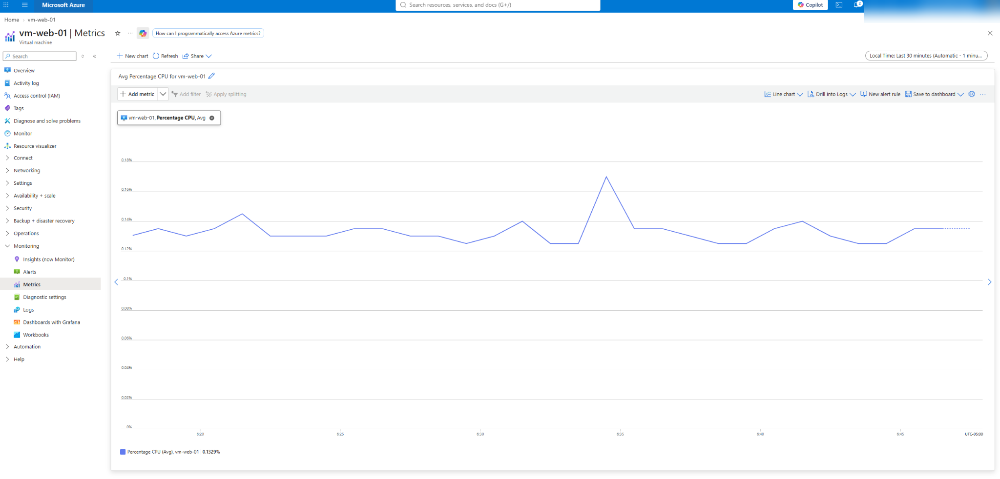
The Azure Activity Log was used to review management-plane operations such as Run Command and VM updates.
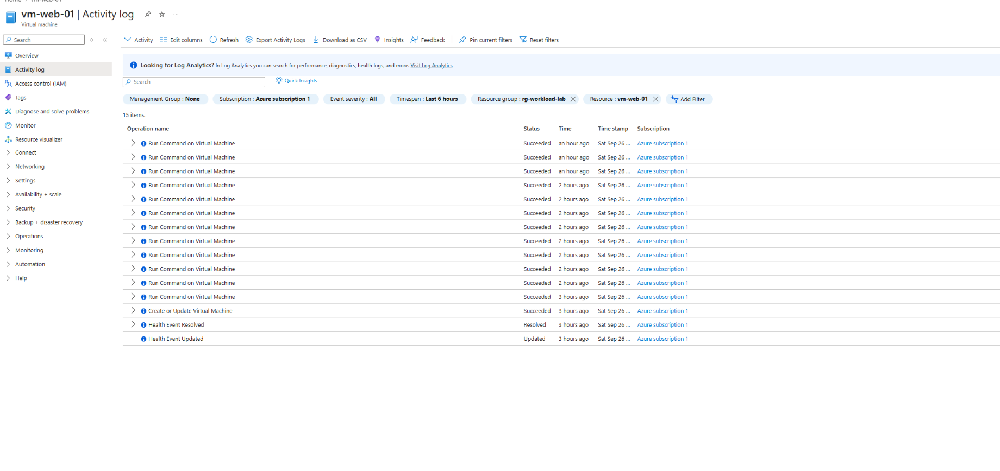
Cost Management
Automatic VM shutdown was enabled.
The VM was manually stopped and deallocated after testing to minimize unnecessary compute charges.
Skills Practiced
Azure Resource Groups
Azure Virtual Networks
Subnetting and CIDR
Network Security Groups
NSG rule priorities
Linux virtual machines
Public and private IP addressing
Nginx
HTTPS/TLS
Self-signed certificates
Azure RBAC
Microsoft Entra security groups
Azure Monitor
Azure Activity Log
Troubleshooting
Cost management
Result
Successfully deployed and validated a segmented Azure lab environment with networking, NSGs, Linux VM administration, Nginx, HTTPS, RBAC, monitoring, troubleshooting, and cost controls.
